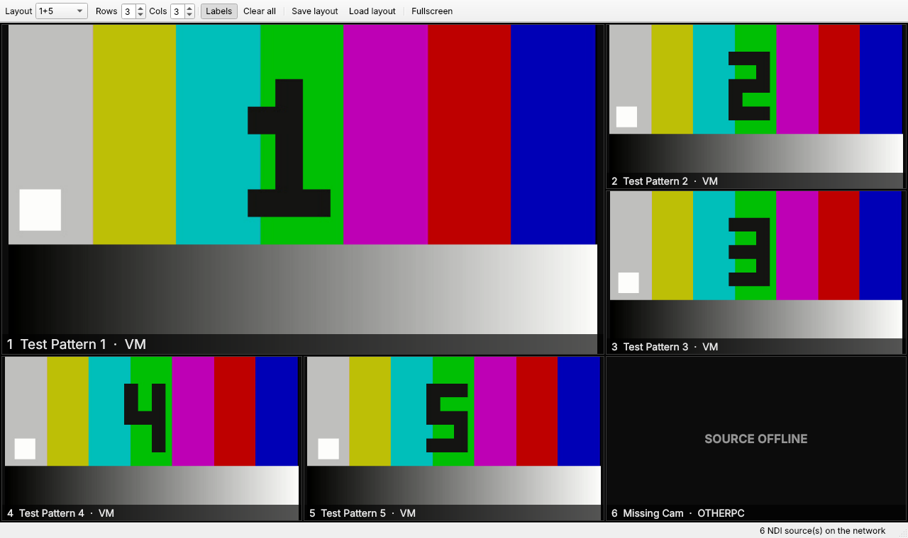

# NDI Multiviewer

Watch several NDI sources at once in a grid you choose, and pick which NDI
source feeds each input.



## What it does

- **Choose the grid.** Presets (1x1, 1x2, 2x2, 3x3, 4x4, 5x5, 1+5, 1+7, 2+8)
  or any custom rows x columns up to 8x8.
- **Route any source to any input.** Click a tile to get a menu of every NDI
  source on the network and pick one (or None).
- **Survives restarts and dropouts.** The layout and routing autosave. An
  input whose source isn't on the network shows SOURCE OFFLINE and reconnects
  by itself when the source comes back. A source that stops sending shows
  NO SIGNAL.
- **Changing layout keeps routing.** Shrinking the grid keeps the hidden
  inputs' assignments, so growing it again restores them.
- Double-click a tile to solo it full-window; double-click again to return.
- F11 for fullscreen (Esc to leave), toggle labels, save and load named
  layouts as JSON files.

By default each tile receives the sender's low-bandwidth preview stream, as
hardware multiviewers do, so a 16-up grid stays light on CPU and network.
`--bandwidth highest` requests full quality.

## Run it

Needs Python 3.10+. The NDI runtime ships inside the `cyndilib` wheel, so
there's nothing else to install.

```sh
python -m venv .venv
. .venv/bin/activate          # Windows: .venv\Scripts\activate
pip install -r requirements.txt
python -m ndi_multiviewer     # --fullscreen, --layout show.json, --bandwidth highest
```

No cameras handy? Publish some moving test patterns from another terminal:

```sh
python tools/test_sources.py --count 6
```

## Layout files

```json
{
  "name": "1+5", "rows": 3, "cols": 3,
  "cells": [{"row": 0, "col": 0, "row_span": 2, "col_span": 2}, {"row": 0, "col": 2, "row_span": 1, "col_span": 1}, "..."],
  "assignments": {"0": "STUDIO-PC (Cam 1)", "1": "GFX (Program)"}
}
```

Cells can span rows and columns, so any custom arrangement can be hand-written.
The autosaved file lives in the per-user config folder unless `--layout` is given.

## How it's built

- `ndi_multiviewer/layout.py`: the layout model, presets and JSON save/load.
- `ndi_multiviewer/ndi_backend.py`: NDI discovery and one receiver per tile,
  via [cyndilib](https://github.com/nocarryr/cyndilib) and NDI frame-sync, which
  always hands back the newest frame without blocking.
- `ndi_multiviewer/app.py`: the Qt (PySide6) window, tiles and toolbar.

## Plan / next steps

1. ~~Grid layouts, per-input source routing, autosave, test sources~~ (this prototype)
2. Tally borders (red/green) and per-tile audio meters
3. Clock and on-screen labels editable per tile
4. GPU (OpenGL) rendering for large grids at full bandwidth
5. Output the multiview itself as an NDI source
6. Packaged installers (PyInstaller) for Windows and macOS

## Tests

```sh
pip install pytest && python -m pytest -q
```
